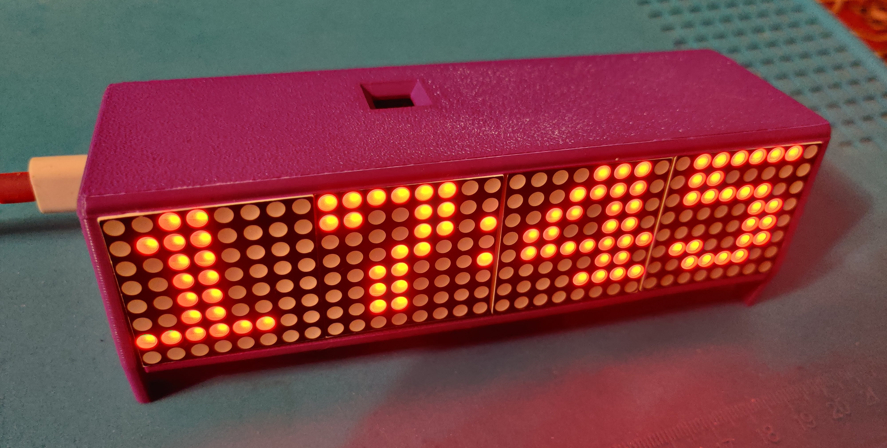

# led-dot-clk

Shelf clock with LED dot matrix display and NTP time synchronization on ESP32-C2 written in Rust (and embassy).

## Features

- NTP time sync - automatically synchronizes time over Wi-Fi with an NTP server
- Gesture detection - uses a reflective sensor to detect a hand wave, waking up the display on demand
- Auto off - display stays off by default to avoid disturbing light at night, and turns on only when motion is detected

## Build

```bash
# Add target riscv32imc-unknown-none-elf
rustup target add riscv32imc-unknown-none-elf

# Build
cargo build --release
```

## Photo


